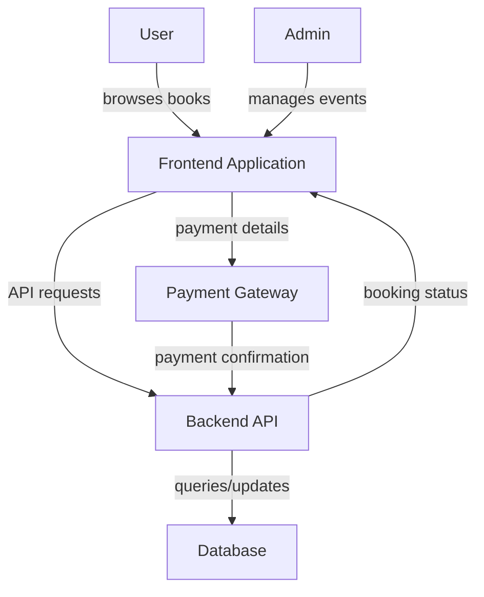

# BookMySeat

## Introduction

BookMySeat is a comprehensive web application designed to simplify and automate the process of booking seats for various events, such as movies, concerts, or conferences. The repository provides an end-to-end solution, handling everything from user authentication and seat selection to payment processing and booking confirmation. With a modern tech stack and a modular architecture, BookMySeat addresses the needs of both users and administrators, ensuring a seamless and efficient reservation experience.

## Usage

To use BookMySeat, clone the repository and follow the setup instructions provided in the documentation or installation scripts. After setup, users can register, log in, browse available events, select their preferred seats, and proceed to payment. Administrators can manage events, venues, and oversee seat allocations through a dedicated dashboard.

### Basic Setup Steps

- Clone the repository:
  ```bash
  git clone https://github.com/Manav-Sonawane/BookMySeat.git
  cd BookMySeat
  ```
- Install the dependencies (typically via npm, yarn, or pip depending on the stack).
- Configure environment variables for database and payment integrations.
- Start the backend and frontend servers as instructed in the project documentation.
- Access the application via the provided local or deployed URL.

### User Workflow

1. Register or log in to the system.
2. Browse through the list of available events.
3. Select an event and view the seating chart.
4. Choose preferred seats and add them to the booking cart.
5. Proceed to payment and confirm the booking.
6. Receive a confirmation with booking details.

### Administrator Workflow

- Log in to the admin panel.
- Add new events or venues.
- Monitor bookings and seat allocations.
- Manage user accounts and resolve issues.

## Features

BookMySeat offers a rich set of features aimed at delivering a robust and user-friendly booking solution.

- **User Authentication**
  - Secure sign-up, login, and password management.
  - Role-based access for users and administrators.

- **Event and Venue Management**
  - Create, edit, and delete events.
  - Venue management with dynamic seat mapping.

- **Interactive Seat Selection**
  - Real-time seat availability status.
  - Visual seat map with selection highlights and disabled booked seats.

- **Booking and Payment Processing**
  - Intuitive booking cart and checkout flow.
  - Integration with popular payment gateways for secure transactions.
  - Email or in-app notifications for booking confirmations.

- **Admin Dashboard**
  - View and manage all events and bookings.
  - Analytics and reporting on occupancy and sales.

- **Responsive User Interface**
  - Modern, mobile-friendly design for accessibility across devices.
  - Clear navigation and user guidance.

- **Scalable Architecture**
  - Modular backend and frontend for easy maintenance and expansion.
  - Database support for persistent event, user, and booking data.

- **Security and Data Protection**
  - Protection against common web vulnerabilities.
  - Secure handling of payment and personal data.

---

> BookMySeat is ideal for event organizers and venue managers looking for a complete, customizable booking system. Its extensible architecture allows for the addition of new features, such as QR code check-ins, loyalty programs, or integration with third-party services.

---

## Example Architecture Diagram



---

For detailed installation instructions, API documentation, and contribution guidelines, please refer to the respective sections in the repository documentation.
